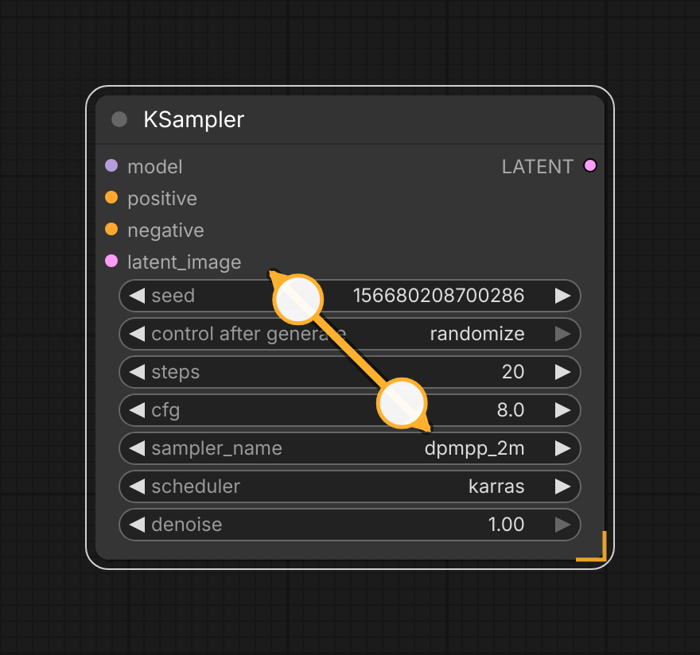

# comfyui-touch-resize

Selection-gated pinch-to-resize for ComfyUI nodes and groups on touch devices.

> Part of a family of mobile-first ComfyUI usability packs
> ([gallery-loader](https://github.com/laurigates/comfyui-gallery-loader),
> [sampler-info](https://github.com/laurigates/comfyui-sampler-info)):
> touch-friendly gestures and HTML modals that replace clunky native
> LiteGraph interactions, additive and non-clobbering.



*A two-finger pinch on a selected node resizes it. The amber corner bracket is
the discoverability hint the pack paints on selected nodes/groups; the
fingertips + arrow here are an illustration of the gesture.*

## Install

```sh
cd <ComfyUI>/custom_nodes
git clone https://github.com/laurigates/comfyui-touch-resize
```

Restart ComfyUI; hard-refresh the browser tab (Ctrl+Shift+R / Cmd+Shift+R).

## What it does

TODO — describe the widgets it enhances and the modal it opens.

## Compatibility

- ComfyUI: modern Vue frontend (`comfyui-frontend-package >= 1.40`) for
  the canvas pointer-event model (`app.canvas`, `ds.scale`/`ds.offset`).
- Frontend changes (JS/CSS) take effect on browser hard-refresh — no restart.

## License

MIT — see `LICENSE`.
