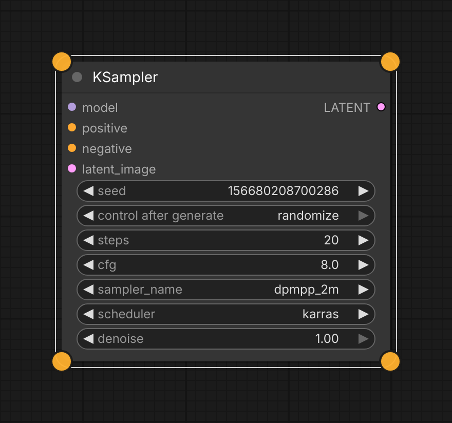

# comfyui-touch-resize

Big corner grab-handles for resizing ComfyUI nodes and groups on touch devices.

> Part of a family of mobile-first ComfyUI usability packs, built on
> [comfy-modal-kit](https://github.com/laurigates/comfy-modal-kit)
> ([gallery-loader](https://github.com/laurigates/comfyui-gallery-loader),
> [model-gallery](https://github.com/laurigates/comfyui-model-gallery),
> [prompt-editor](https://github.com/laurigates/comfyui-prompt-editor),
> [sampler-info](https://github.com/laurigates/comfyui-sampler-info),
> [touch-connect](https://github.com/laurigates/comfyui-touch-connect),
> [touch-numeric](https://github.com/laurigates/comfyui-touch-numeric),
> [touch-tooltips](https://github.com/laurigates/comfyui-touch-tooltips)):
> touch-friendly gestures and HTML modals that replace clunky native
> LiteGraph interactions, additive and non-clobbering.



*Select a node and four amber grab handles appear at its corners. Drag one to
resize. Everything in this shot is drawn by the pack — nothing is illustrated.*

## Install

```sh
cd <ComfyUI>/custom_nodes
git clone https://github.com/laurigates/comfyui-touch-resize
```

Restart ComfyUI; hard-refresh the browser tab (Ctrl+Shift+R / Cmd+Shift+R).

## What it does

Select a node or group and the pack paints **four big amber circles at its
corners**. Drag one to resize — the opposite corner stays anchored, so the item
grows from the corner you grabbed rather than from its origin.

- **Sized for fingers, not cursors.** The circles are drawn at a constant
  on-screen size regardless of zoom, and their touch target is nearly twice the
  drawn radius (~36px across) so they stay hittable at any zoom level.
- **Nodes and groups.** Handles trace the item's visible outline — for a node
  that includes its title bar, which keeps them clear of the input and output
  slots. After a group resize its node membership is recomputed, so moving it
  still carries the right nodes.
- **Single selection only.** Handles appear when exactly one item is selected.
  A rubber-band selection of ten nodes would otherwise paint forty circles and
  leave "which item does this handle resize?" unanswerable.
- **Respects LiteGraph's own rules.** Pinned items (which LiteGraph forbids
  moving or resizing) and collapsed nodes get no handles.
- **Additive, no-op fallback.** The pack writes only `pos` and `size`, both
  already serialized. If `app.canvas` or the pointer model is absent it does
  nothing, so the native corner-handle resize and canvas zoom keep working.

Escape, or switching away from the window, ends a drag in progress. Bringing a
second finger down during a drag abandons the resize and hands the gesture to
ComfyUI's own two-finger pinch-zoom.

There are no custom nodes, widgets, or modals — this is a frontend-only canvas
affordance layer.

## Why handles instead of a pinch gesture

Versions up to 0.1.x used a two-finger pinch on a selected node. It was replaced
because that interaction is structurally at odds with how LiteGraph consumes
pointer events:

A pinch cannot be recognized until the **second** finger lands, by which time
the first finger's `pointerdown` has already reached LiteGraph and opened a
node-drag or canvas-pan transaction. Everything after that was damage control —
suppressing the move stream, intercepting `wheel`, and trying to hand the
half-open transaction back on release. The canvas could still end up "stuck in
two-finger mode", recovering only when you switched apps.

That stuck state had a specific cause. ComfyUI's built-in
`Comfy.SimpleTouchSupport` keeps a global count of active touches and patches
`LGraphCanvas.processMouseDown` to return early whenever that count is non-zero.
The old suppression layer swallowed `touchstart` but deliberately let `touchend`
through, so the count drifted **negative** — which is also non-zero — and the
canvas stopped responding to taps until `visibilitychange` reset it. That is
exactly the app-switch recovery that was observed.

A corner handle is hit-tested on the very **first** `pointerdown`, so that event
is suppressed before LiteGraph opens any transaction, and there is no half-open
state to recover from. The pack now touches only the pointer-event stream and
never the touch events, so that count stays balanced. Roughly half the source
went away with the gesture.

## Compatibility

- ComfyUI: modern Vue frontend (`comfyui-frontend-package >= 1.40`) for
  the canvas pointer-event model (`app.canvas`, `ds.scale`/`ds.offset`).
- Handles are drawn on the canvas, so they are **not** visible when the
  experimental **Nodes 2.0** setting (`Comfy.VueNodes.Enabled`, DOM-rendered
  nodes) is on. It defaults to off for self-hosted installs.
- Frontend changes (JS/CSS) take effect on browser hard-refresh — no restart.

## License

MIT — see `LICENSE`.
