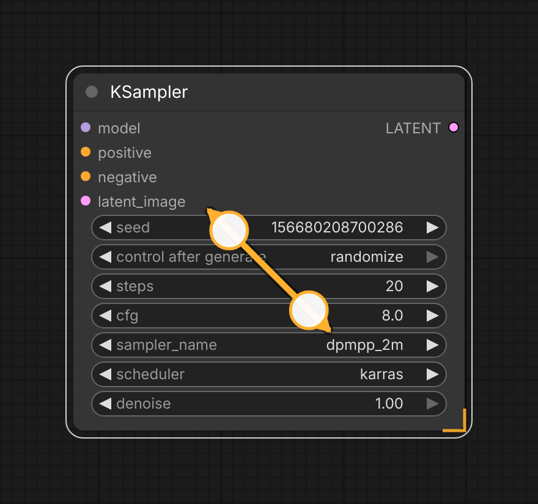

# comfyui-touch-resize

Selection-gated pinch-to-resize for ComfyUI nodes and groups on touch devices.

> Part of a family of mobile-first ComfyUI usability packs, built on
> [comfy-modal-kit](https://github.com/laurigates/comfy-modal-kit)
> ([gallery-loader](https://github.com/laurigates/comfyui-gallery-loader),
> [model-gallery](https://github.com/laurigates/comfyui-model-gallery),
> [prompt-editor](https://github.com/laurigates/comfyui-prompt-editor),
> [sampler-info](https://github.com/laurigates/comfyui-sampler-info),
> [touch-connect](https://github.com/laurigates/comfyui-touch-connect),
> [touch-numeric](https://github.com/laurigates/comfyui-touch-numeric),
> [touch-tooltips](https://github.com/laurigates/comfyui-touch-tooltips)):
> touch-friendly gestures and HTML modals that replace clunky native
> LiteGraph interactions, additive and non-clobbering.



*A two-finger pinch on a selected node resizes it. The amber corner bracket is
the discoverability hint the pack paints on selected nodes/groups; the
fingertips + arrow here are an illustration of the gesture.*

## Install

```sh
cd <ComfyUI>/custom_nodes
git clone https://github.com/laurigates/comfyui-touch-resize
```

Restart ComfyUI; hard-refresh the browser tab (Ctrl+Shift+R / Cmd+Shift+R).

## What it does

Adds a canvas-level touch gesture: **two-finger pinch to resize** whatever is
selected. Tap a node or group to select it, then pinch with two fingers whose
centroid lands inside the selection — the node/group grows or shrinks with the
spread instead of the canvas zooming. While the pinch is locked, native
canvas zoom is suppressed so the gesture doesn't fight the pan/zoom layer.

- **Amber corner-bracket hint** — a faint `#ffb02e` bracket is painted on
  selected nodes/groups as a discoverability affordance, staying roughly
  constant on-screen size across zoom levels.
- **Uniform vs anisotropic modes** — `uniform` (default) scales width and
  height together; `aniso` lets a mostly-horizontal or mostly-vertical pinch
  change one dimension independently.
- **Additive, no-op fallback** — the pack only writes `node.size` / `group.size`
  (already serialized), never clobbering existing behavior. If `app.canvas` or
  the pointer model is absent it does nothing, so the native corner-handle
  resize and canvas zoom keep working exactly as before.

There are no custom nodes, widgets, or modals — this is a frontend-only canvas
gesture layer.

## Compatibility

- ComfyUI: modern Vue frontend (`comfyui-frontend-package >= 1.40`) for
  the canvas pointer-event model (`app.canvas`, `ds.scale`/`ds.offset`).
- Frontend changes (JS/CSS) take effect on browser hard-refresh — no restart.

## License

MIT — see `LICENSE`.
